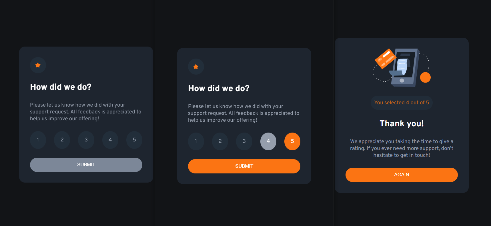

# Frontend Mentor - Interactive rating component solution

This is a solution to
the [Interactive rating component challenge on Frontend Mentor](https://www.frontendmentor.io/challenges/interactive-rating-component-koxpeBUmI).
Frontend Mentor challenges help you improve your coding skills by building realistic projects.

## Table of contents

- [The challenge](#the-challenge)
- [Screenshot](#screenshot)
- [Links](#links)
- [Author](#author)

### The challenge

Users should be able to:

- View the optimal layout for the app depending on their device's screen size
- See hover states for all interactive elements on the page
- Select and submit a number rating
- See the "Thank you" card state after submitting a rating

Optional:

- Added inactive button state, the button is active only when the rating value is selected
- Added reset of the selected item when clicking outside the rating numbers
- Added button "again" to return to the initial state

### Screenshot

### Links

- Live Site URL: [Live site URL here](https://mister-mandarin.github.io/interactive-rating-component)

### Author

- GitHub - [@mister-Mandarin](https://github.com/mister-Mandarin)
- Frontend Mentor - [@mister-Mandarin](https://www.frontendmentor.io/profile/mister-Mandarin)
- VK - [@Andrey](https://vk.com/andrei_poluektov)
- Instagram - [@Mandarin](https://www.instagram.com/andrey_poluehktov/)
